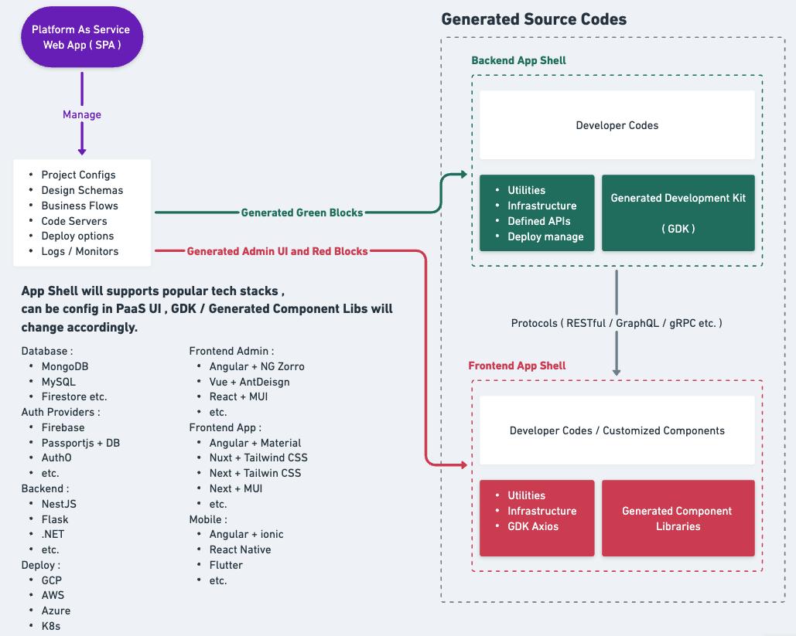

# AUTOMATICODE . IO

Instant generate out of box full-stack source codes.

## How does it work ?
  
[See more detail in Whimsical](https://whimsical.com/automaticode-LEvhKTxLQXdn5pzRgQQUbr)

### Our goal is let developers / organizations only worried about the White Blocks, we provide out of box / production ready source codes to speed up every project's iteration cycle.
### 80/20 Rule - Every product / project is distinguish by only 20% of it's special logic / features. We want to solve your 80% hassle and workloads.

# Up and Running
This starter repo currently supports below tech stack:
| Auth Provider  | Database |  Email |   |   |
|----------------|----------|---|---|---|
| Firebase Auth  | MongoDB  |  SendGrid |   |   |

More are coming, star this repo to stay ahead.

```
npm install
```

**NOTE:** You might need to delete `@types/glob @types/rimraf @types/minimatch` under `node_modules` temporary.

## Register Firebase / SendGrid / MongoDB

### Register Firebase

1. Go to [Firebase Official](https://firebase.google.com/) create a account and setup your project.
2. Go to **Project Overview / Project Settings** ( At left top corner ), scroll down to **Your apps** section.
3. Click **[ Add App ]** button to create a Javascript platform (Web app).
4. After created, you will get the `firebaseConfig` sample codes at **Step 2** , fill them into `.env` `// * FIREBASE APP , FROM ADD APP`
5. Go to **Project Settings / Service Accounts** Tab, click **[ Generate new private key ]** to download `xxx.json`.
6. fill accordingly into `.env` `// * FIREBASE ADMIN SDK , FROM SERVICE ACCOUNT JSON (NEW)`

### Register SendGrid
1. Go to [SendGrid Official](https://sendgrid.com/) create a account.
2. After signed up, go to **Settings / API Keys** at left menu, click **[ Create API Key ]** button.
3. Copy the API Key paste to `.env` `SENDGRID_API_KEY=`.
4. In order to validate a sender, you will need to go to **Settings / Sender Authentication**, verify a Email sender.
5. After verified, update to `.env` `SENDGRID_SENDER_EMAIL=`


### Setup MongoDB
1. If you wish to run locally, follow [Install MongoDB Community Edition](https://www.mongodb.com/docs/manual/administration/install-community/) to set it up. After successfully setup, you will get the `MONGO_URI` also known as connection string. Update to `.env` `MONGO_URI=`. And set your preferred `.env` `MONGO_DB_NAME`.
2. Alternative, you can setup a Cloud version using [MongoDB Atlas Getting Start](https://www.mongodb.com/cloud/atlas/register). It's free to get start. Update to `.env` `MONGO_URI=`. And set your preferred `.env` `MONGO_DB_NAME`, once you followed the get start process.
3. Remember to allow network access for your current IP. 
 

## Setup .env
```
STAGE=DEV

// * NEST-JS
DISABLE_ERROR_META=true

// * AUTH
AUTH_CODE_EXPIRE_MIN=5

// * FIREBASE ADMIN SDK , FROM SERVICE ACCOUNT JSON (NEW)
FIREBASE_ADMIN_CLIENT_EMAIL=
FIREBASE_ADMIN_PRIVATE_KEY=
FIREBASE_ADMIN_PROJECT_ID=

// * FIREBASE APP , FROM ADD APP
FIREBASE_API_KEY=
FIREBASE_AUTH_DOMAIN=
FIREBASE_PROJECT_ID=
FIREBASE_STORAGE_BUCKET=
FIREBASE_MESSAGE_SENDERID=6
FIREBASE_APPID=
FIREBASE_MEASURMENT_ID=

// * SENDGRID
SENDGRID_API_KEY=
SENDGRID_SENDER_EMAIL=

// * MONGODB
MONGO_URI=
MONGO_DB_NAME=
```


## Review Configuration
We have a file `automaticode.json` that configures our project, you don't have to change anything ( mostly doesn't affect yet). You can configure `Auth.Roles` and `Auth.CustomTokenUserPayloadProperties` to suit your needs.
Please use `kebab-case` while you are adding your roles. (E.g. admin , super-admin, general-manager )

**NOTE:** `"general super admin"` is default reserved roles, will remove in the near future.

```
npm run auto
```
```
Choose -> E) Sync User and Role from automaticode.json Config.User
```

This would sync the Roles to GDK modules.

**NOTE:** You can customized your User Schema using `automaticode/schemas/user-extra.json`.
(COMING SOON)


## Design {schema}.json
  
`{schema}`.json is a configuration files that setup the DB Collections / Tables. Our generators will process it and generate GDK accordingly. For this **Nest App Shell** will generated following : 
- `{schema}`.static.ts
- `{schema}`.type.ts
- `{schema}`/dtos/create-`{schema}`.dto.ts
- `{schema}`/dtos/update-full-`{schema}.`dto.ts
- `{schema}`.schema.ts ***(Mongoose Schema)***
- `{schema}`.service.ts
- `{schema}`.controller.ts
- `{schema}`.module.ts

### Configure Schema JSON File 

1. To generate a schema file for you :
```
npm run auto
```
```
Choose -> A) Create a new schema
Enter -> your-schema-name-with-kebab-case
```

**Files would generated under** `automaticode/schemas/{your-schema}.json`

2. Change Schema Content. 

| Key Name 	| Type 	| Default 	| Usage 	| Implemented 	|
|---	|---	|---	|---	|---	|
| version 	| Number 	| 1 	| versioning GDK generator 	| NO 	|
| name 	| String 	| From npm run auto, your entered 	| Use kebab-case to name it 	| YES 	|
| defaultWriteRoles 	| String 	| "" 	| Will add RoleGuards to POST / PUT / DELETE accordingly 	| NO 	|
|  	|  	|  	| Empty string "" - Public 	|  	|
|  	|  	|  	| Specific kebab-roles with " "separate<br>E.g. "admin general-user"  	|  	|
| defaultReadRoles 	| String 	| "" 	| Will add RoleGuards to GET accordingly 	| NO 	|
|  	|  	|  	| Empty string "" - Public 	|  	|
|  	|  	|  	| Specific kebab-roles with " "separate<br>E.g. "general-user super-admin" 	|  	|
| includeCreatedAt 	| Boolean 	| false 	| Will generate `createdAt` 	| YES 	|
| includeUpdatedAt 	| Boolean 	| false 	| Will generate `udpatedAt` and implement accordingly 	| YES 	|
| enableSoftDelete 	| Boolean 	| false 	| Will add a key `isSoftDeleted` to tag the document is not avaiable 	| YES 	|
|  	|  	|  	| Will generate `SoftDelete` DELETE API  	| YES 	|
|  	|  	|  	| Will generate GET APIs to differentiate 	| NO 	|
| mongoEnableTextSearch 	| Boolean 	| false 	| Will and text search index for you, base on `mongoTextSearchPropertyNames` 	| NO 	|
| mongoTextSearchPropertyNames 	| String 	| "" 	| Specific properties with " "separate 	| NO 	|
| properties 	| Array 	| [] 	| Design your properties (Columns) under this schema 	| YES 	|


3. Adding Properties

| Key Name 	| Type 	| Default 	| Usage 	| Implemented 	|
|---	|---	|---	|---	|---	|
| name 	| String 	| "" 	| property-name 	| YES 	|
| alias 	| String 	| "" 	| UI display 	| NO 	|
| descriptionNote 	| String 	| "" 	| Human read notes 	| NO 	|
| type 	| Enum 	| STRING 	| Storing string contents 	| YES 	|
|  	|  	| NUMBER 	| Storing number contents 	| YES 	|
|  	|  	| BOOLEAN 	| Storing boolean ( true / false ) 	| YES 	|
|  	|  	| REFERENCE_USER_ID 	| Is reference to UserId 	| YES 	|
|  	|  	| REFERENCE_ID 	| Is the reference to other schema Id, needs to be specific `referenceSchemaName` 	| YES 	|
|  	|  	| REFERENCE_ID_ARRAY 	| Same as above, but with an Array 	| NO 	|
|  	|  	| DATE 	| Storing milliseconds ( as number ) 	| YES 	|
|  	|  	|  	| Will generate query API accordingly  	| NO 	|
|  	|  	| TIMESTAMP 	| Storing milliseconds ( as number ) 	| YES 	|
|  	|  	|  	| Will generate write API accordingly 	| NO 	|
|  	|  	| DURATION 	| Will generate `{name}StartAt` and `{name}EndAt` 	| YES 	|
|  	|  	|  	| Will generate query API accordingly 	| NO 	|
|  	|  	| ENUM_OPTION 	| Needs to be specific at `enumOptions` 	| YES 	|
|  	|  	|  	| Will generate typescript Enum accordingly 	| YES 	|
|  	|  	|  	| Will generate query API accordingly 	| YES 	|
|  	|  	|  	| Will generate write API accordingly 	| YES 	|
|  	|  	| STRING_ARRAY 	| Storing [String] 	| YES 	|
|  	|  	| NUMBER_ARRAY 	| Storing [Number] 	| YES 	|
|  	|  	| BOOLEAN_ARRAY 	| Storing [Boolean] 	| YES 	|
|  	|  	| OBJECT 	| Storing nested schema 	| NO 	|
|  	|  	| ARRAY_OBJECT 	| Storing nested schema list 	| NO 	|
|  	|  	| EMAIL 	| Storing string, but will validate if is email 	| YES 	|
|  	|  	| IMAGE_URL 	| Storing string 	| YES 	|
|  	|  	|  	| Will generated upload API 	| NO 	|
|  	|  	| IMAGE_URL_ARRAY 	| Storing [String] 	| YES 	|
|  	|  	|  	| Will generated upload API 	| NO 	|
|  	|  	| QUILL_RICH_TEXT_EDITOR 	| Storing contents for [Quill Editor](https://quilljs.com/) 	| NO 	|
|  	|  	|  	|  	|  	|
| default 	| Any 	| null 	| Gives a default value 	| NO 	|
| referenceSchemaName 	| String 	| "" 	| If type is `REFERENCE_ID` or `REFERENCE_ID_LIST`, defined the schema name here 	| YES 	|
| enumOptions 	| String 	| "" 	| If type is `ENUM_OPTIONS` 	| YES 	|
|  	|  	|  	| Use kebab-name to separate, E.g.  "pending already-paid rejected" 	| YES 	|
| objectDefinition 	| Object 	| null 	| If type is `OBJECT` or `ARRAY_OBJECT`, defined the nested schema here 	| NO 	|
| isUnique 	| Boolean 	| false 	| Will generated check API accordingly 	| YES 	|
| isRequired 	| Boolean 	| false 	| Will generated check API accordingly 	| YES 	|
| isEnableMongoIndex 	| Boolean 	| false 	| If you want to set an index for this property 	| YES 	|
|  	|  	|  	| Will generated query API accordingly 	| YES 	|

## Run Script
After complete above designs, ready to see the magic.

```
npm run auto
```
```
Choose -> C) Generate GDK modules base on all Schemas

```
## Check the Generated APIs in Swagger

```
npm run start:dev
```

Go to http://localhost:4500/swagger  , see the generated APIs and start using !