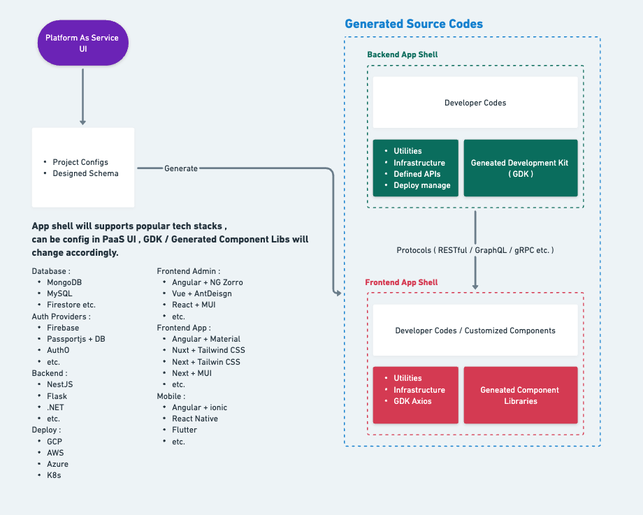

# AUTOMATICODE . IO

Instant generate out of box full-stack source codes.

## How does it work ?

[See more detail in Whimsical](https://whimsical.com/automaticode-LEvhKTxLQXdn5pzRgQQUbr)

### Our goal is let developers / organizations only worried about the White Blocks, we provide out of box / production ready source codes to speed up every project's iteration cycle.
### 80/20 Rule - Every product / project is distinguish by only 20% of it's special logic / features. We want to solve your 80% hassle and workloads.

# Up and Running
This starter repo currently supports below tech stack:
| Auth Provider  | Database |  Email |   |   |
|----------------|----------|---|---|---|
| Firebase Auth  | MongoDB  |  SendGrid |   |   |

More are coming, star this repo to stay ahead.

## Setup ENV

## Review Configuration
## Understanding {SCHEMA}.json
## Run Script
## Check the Generated APIs in Swagger